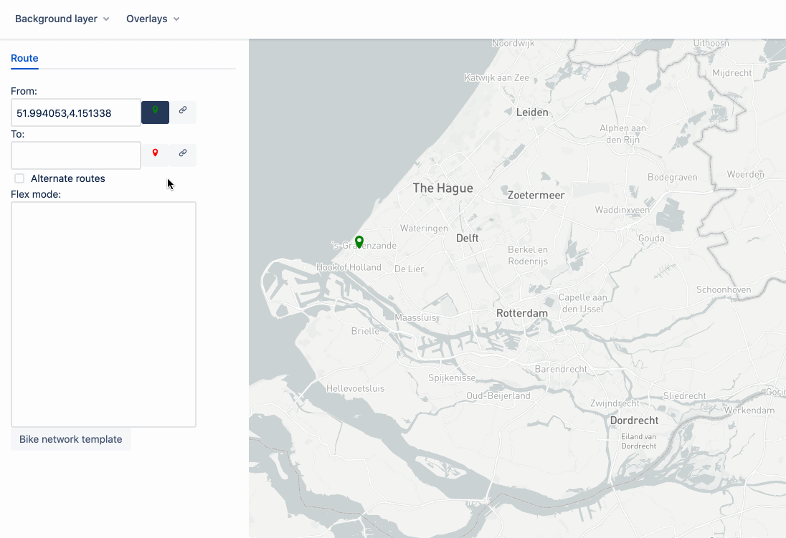

# GraphHopper React

A React playground to explore the functionalities of GraphHopper. The project can be used as a basic route exploring tool.

GraphHopper React is inspired by GraphHopper Web ([[1]](https://github.com/graphhopper/graphhopper/blob/stable/docs/index.md) [[2]](https://github.com/graphhopper/graphhopper/tree/master/web)) and meant as a modern replacement for it.

## Demo

## Get started

    npm install
    npm start

## Visualization layers

The project builds upon deck.gl, and uses the concept of _Visualization Layers_. The user can add different visualizations to the map:

-   [Route Visualization](docs/route.md)
-   [Isochrone Visualization](docs/isochrone.md)
-   [MVT Visualization](docs/mvt.md)

## Tile Layers

Add a `.env` file with API tokens for different tile layers, e.g.:

    REACT_APP_MAPBOX_TOKEN=<your mapbox token>

## Learn More

This project was bootstrapped with [Create React App](https://github.com/facebook/create-react-app).

You can learn more in the [Create React App documentation](https://facebook.github.io/create-react-app/docs/getting-started).

To learn React, check out the [React documentation](https://reactjs.org/).
