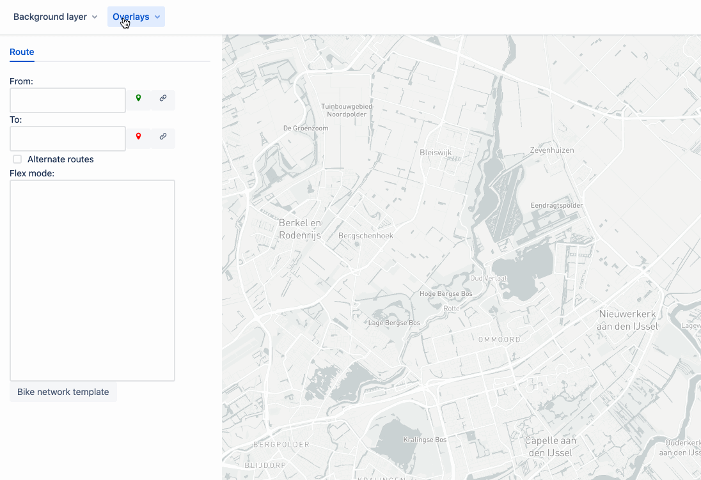

# MVT Layer

The MVT (Mapbox Vector Tile) layer uses the `/mvt` endpoint of GraphHopper. It is meant for development-usage to explore encoded values stored in GraphHopper.

## Demo:

## JSON Schema support (in development):

